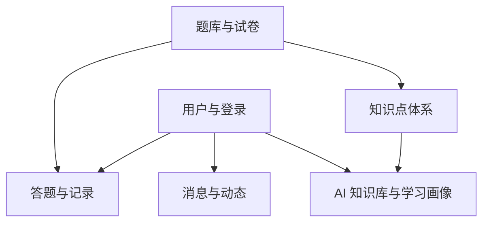
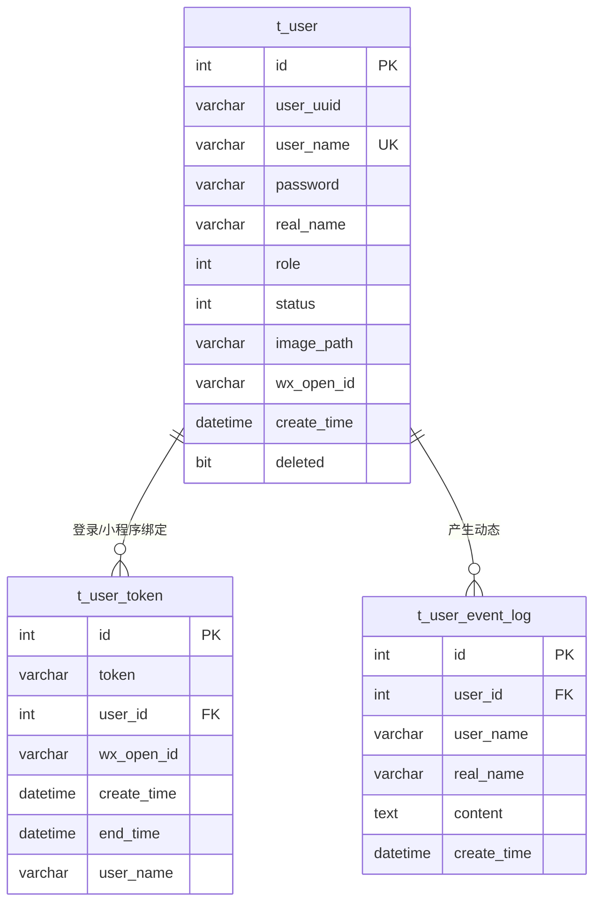
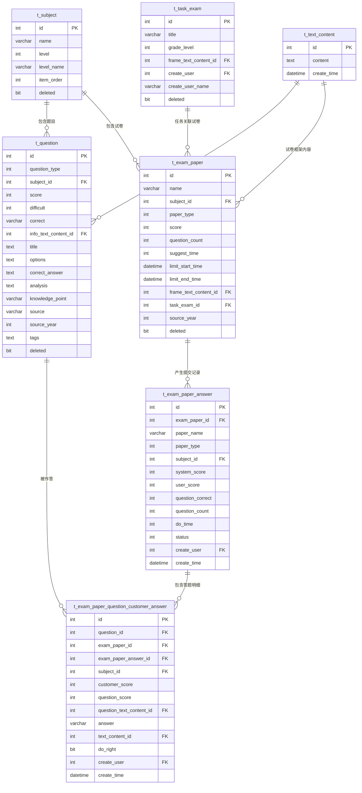
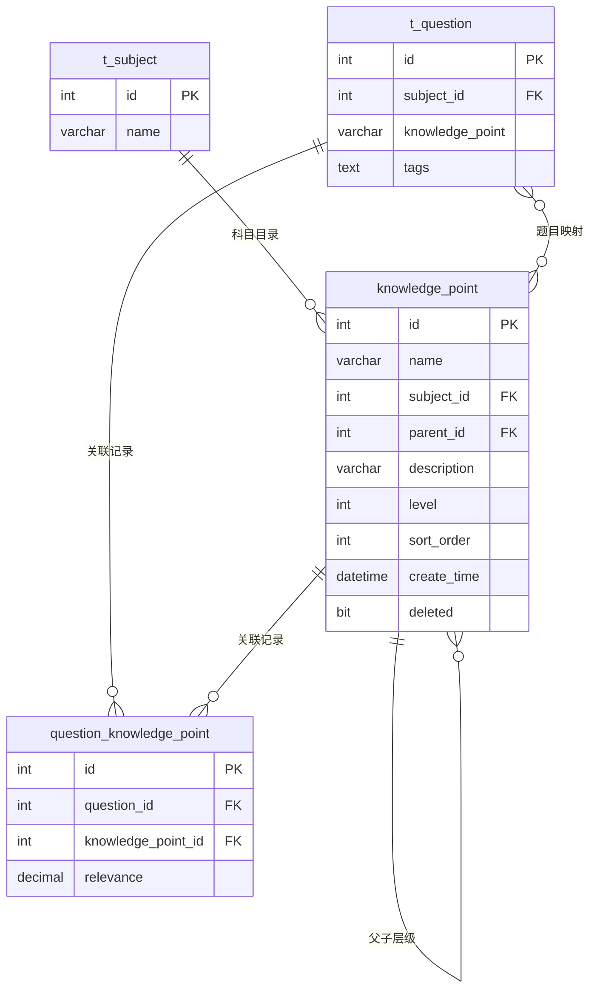
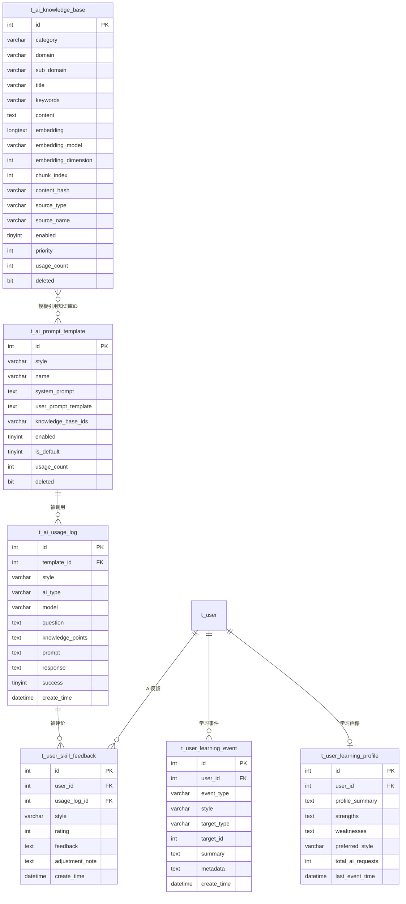
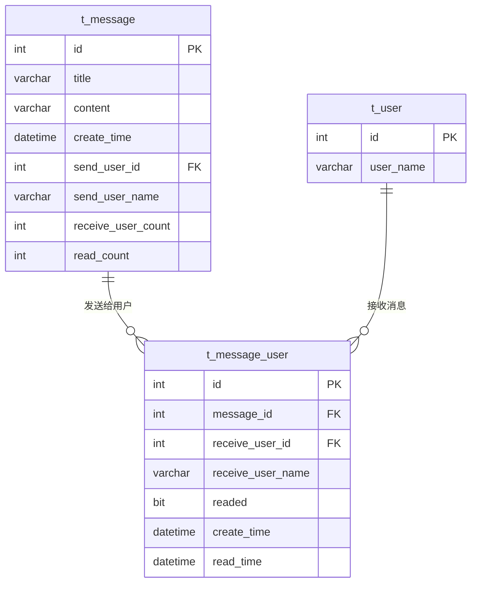

# 408Master 数据库 UR/ER 图

> 说明：本图按业务域拆分，避免一张总图在 Markdown 预览中缩得过小。当前数据库没有完整声明外键，图中的关系按字段语义、Mapper 查询和业务流程整理。

## 1. 总体业务域

## 2. 用户与登录

## 3. 题库、试卷与答题记录

## 4. 知识点体系

## 5. AI 知识库与学习画像

## 6. 消息与通知

## 7. 当前设计要点

- 用户主线：`t_user -> t_user_token -> t_exam_paper_answer -> t_exam_paper_question_customer_answer`。
- 题库主线：`t_subject -> t_question -> t_exam_paper -> t_exam_paper_answer`。
- 知识点主线：`knowledge_point` 自关联形成目录，`question_knowledge_point` 连接题目。
- AI 主线：`t_ai_knowledge_base` 提供知识内容，`t_ai_prompt_template` 组织提示词，`t_ai_usage_log` 记录调用，学习画像表沉淀用户状态。
- 需要注意：图中 FK 多数是逻辑外键，当前 SQL 中并未普遍创建数据库级外键约束。
