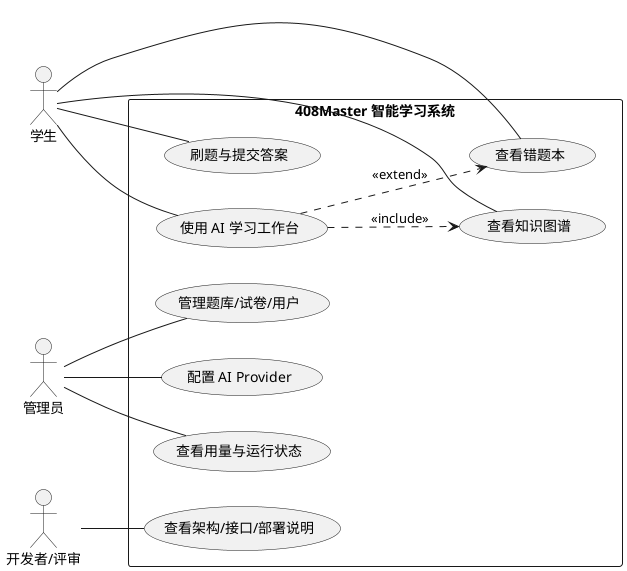
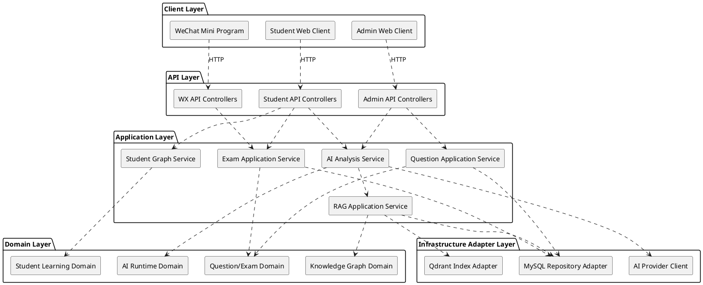
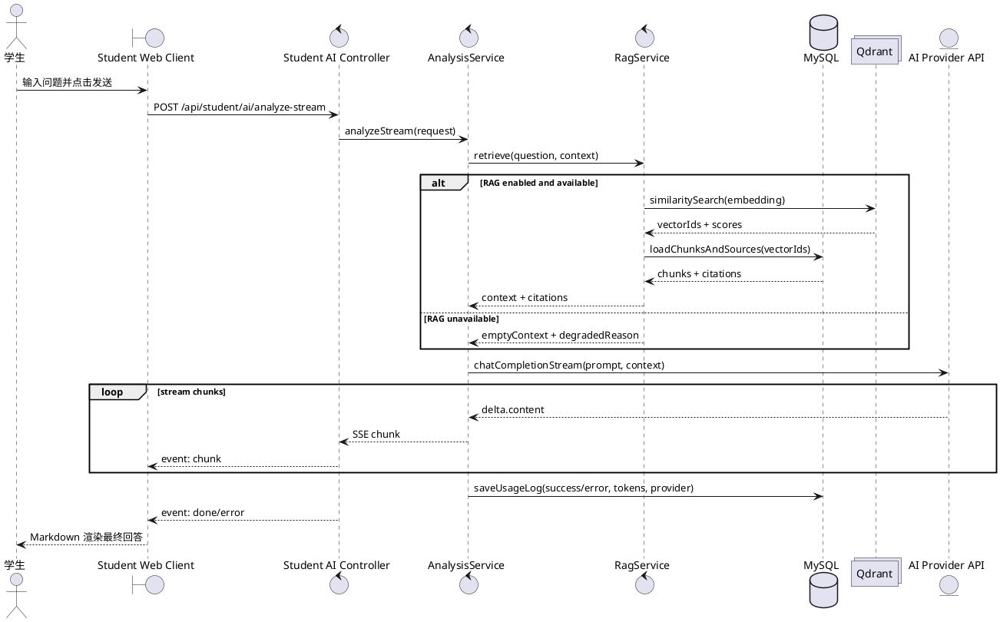
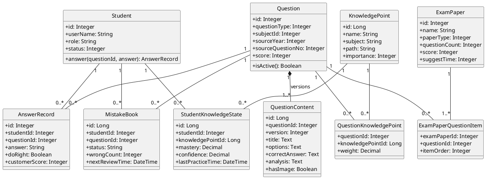
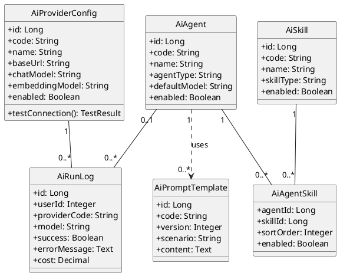
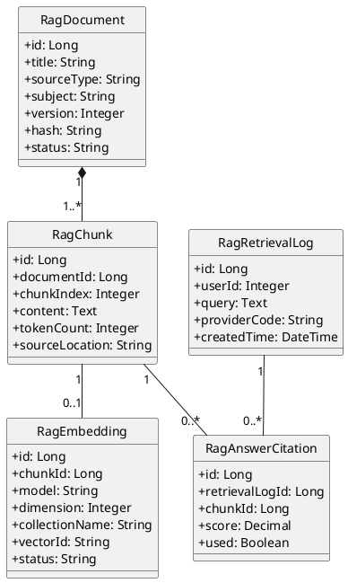
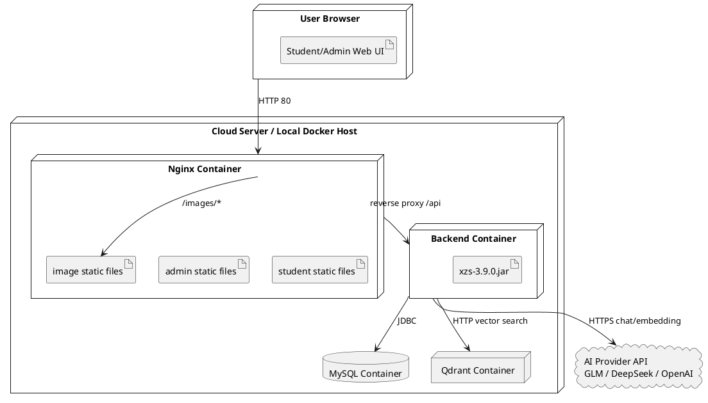

# 408Master UML 标准建模说明

本文档用于学习和校准本项目的 UML 表达。结论先说清楚：当前 Developer Brief 页面里的 Mermaid 图适合做演示视图，但其中用例图和组件图并不是严格 UML。若目标是学习 UML 标准，建议以本文档的 PlantUML 写法作为标准版本，再决定是否把它们渲染成图片放入页面。

## 1. UML 基本原则

UML 是 Unified Modeling Language，统一建模语言。它不是某个框架，也不是必须生成代码的工具，而是一套约定好的图形语言，用来表达软件系统中的参与者、功能目标、模块边界、对象结构、调用顺序和部署环境。

本项目最适合使用五类 UML 图：

| 图类型 | 解决的问题 | 本项目用途 |
|---|---|---|
| 用例图 Use Case Diagram | 谁使用系统，系统对外提供什么能力 | 讲学生、管理员、开发者/评审分别能做什么 |
| 组件图 Component Diagram | 系统由哪些可替换的模块组成，模块之间怎么依赖 | 讲 Vue、Controller、Service、Domain、Infrastructure 的模块边界 |
| 时序图 Sequence Diagram | 一次请求中，对象/服务按什么顺序交互 | 讲 AI/RAG 流式回答链路 |
| 类图 Class Diagram | 业务对象有哪些属性、方法、关系和多重性 | 讲题目、知识点、学生图谱、RAG、AI Runtime 的领域对象 |
| 部署图 Deployment Diagram | 软件部署在哪些节点、容器、外部服务上 | 讲 Nginx、Backend、MySQL、Qdrant、AI Provider 的运行拓扑 |

## 2. Developer Brief 当前 Mermaid 图的标准性判断

| 当前图 | 标准性判断 | 建议 |
|---|---|---|
| `flowchart LR` 用例图 | 只能算“类用例图”。Mermaid flowchart 不是真正的 UML Use Case Diagram。 | 页面标题建议写“用例视图”，标准文档中使用 PlantUML 用例图。 |
| `classDiagram + <<component>>` 组件图 | 只能算“类图语法模拟组件图”。它用了 component stereotype，但不是标准 Component Diagram 语法。 | 页面标题建议写“组件视图”，标准文档中使用 PlantUML 组件图。 |
| `sequenceDiagram` 时序图 | 基本符合 UML 时序图表达，有 participant、lifeline、调用消息、返回消息。 | 可以保留，但建议补充失败降级分支。 |
| `classDiagram` 领域类图 | 当前是领域对象关系图，不是完整类图，因为缺少属性、方法和部分中间对象。 | 标准类图应补属性、方法、多重性和关联类。 |
| 架构图里的 Qdrant | 当前代码中存在 `QdrantRagIndexServiceImpl`，可以作为已接入基础设施画出。 | 应画在部署图/基础设施中，不要让核心业务看起来强依赖 Qdrant。 |
| `AiAgent / AiSkill` | 当前 SQL 和 Mapper/Service 中有相关模型，但更偏 AI Runtime 配置模型。 | 可以画，但建议放入 AI Runtime 类图，而不是混在核心题库领域类图里。 |

## 3. 标准用例图

### 标准要点

- Actor 用小人或 actor 符号，表示系统外部的角色。
- Use Case 用椭圆，表示用户想完成的目标。
- Actor 与 Use Case 之间通常用无箭头关联线。
- `include` 表示必然复用，`extend` 表示可选扩展。
- 不要把内部模块、数据库、接口写成用例。

### 408Master 标准用例图

说明：`开发者/评审` 不是业务用户，但它确实是 Developer Brief 页面的外部使用者，所以可以作为 actor。`验证数据库与部署方案` 不建议作为用例，因为它更像人工验收动作，而不是系统稳定提供的功能目标。

## 4. 标准组件图

### 标准要点

- Component 表示可替换、可部署或有明确接口边界的软件模块。
- 组件之间用依赖关系表达调用或使用关系。
- 抽象层级要一致，不要把“Vue 页面、Service 方法、MySQL 表、外部 API”混在同一层级。
- 数据库、Qdrant、外部 AI Provider 更适合画为基础设施组件或部署节点。

### 408Master 标准组件图

说明：这里把 Qdrant 叫作 `Qdrant Index Adapter`，不是核心 Domain。这样更准确：题库、答题、错题不应该因为 Qdrant 不可用而整体不可用。

## 5. 标准时序图

### 标准要点

- `participant` 表示参与交互的对象或服务。
- 垂直虚线是 lifeline。
- 实线箭头表示调用消息，虚线箭头表示返回消息。
- 可以用 `alt/else/end` 表达条件分支。
- 一张时序图只讲一个场景，不要把所有系统流程塞进去。

### 408Master AI/RAG 流式请求时序图

说明：这个图比当前页面里的时序图更标准，因为它补了 `alt` 降级分支，也把 Controller、AnalysisService、RagService 分开了。当前代码里“只允许 delta.content 输出给前端”的策略在图中也有体现。

## 6. 标准领域类图

### 标准要点

- 类图应包含类名、属性、方法。
- 多重性要写清楚，例如 `1`、`0..1`、`*`、`1..*`。
- 多对多关系通常需要中间关联类。
- 领域类图关注业务概念，不等于数据库 ER 图，也不应该复刻所有字段。
- 如果某个对象只是规划或配置模型，要标注清楚。

### 408Master 核心领域类图

说明：这张图只画核心学习领域，不混入 AI Provider、Qdrant、Agent 配置。这样更符合 Domain 建模：题目、知识点、学生状态是业务核心；向量库和模型供应商是支撑能力。

## 7. AI Runtime 类图

如果要讲 AI Agent / Skill，它们应该单独画，不要混在核心题库领域类图里。

说明：这张图表达的是 AI Runtime 配置模型。它可以作为“已建模/逐步接入”的能力讲，不应该说成所有 Agent 业务都已经完整自动化落地。

## 8. RAG 类图

说明：向量本体不建议画成业务类。`RagEmbedding.vectorId` 指向 Qdrant 中的向量记录，MySQL 保存元数据和业务可追溯信息。

## 9. 标准部署图

### 标准要点

- Node 表示运行环境，例如浏览器、服务器、容器。
- Artifact 表示部署到节点上的软件产物，例如 jar、静态资源。
- Database、外部服务可以作为节点或外部系统画出。
- 部署图不讲业务领域关系，它只讲软件运行在哪里、通过什么协议连接。

### 408Master 部署图

说明：部署图应该单独画。不要把 Nginx、Docker、MySQL、Qdrant 混入领域类图；它们是运行环境和基础设施。

## 10. Mermaid 与标准 UML 的关系

Mermaid 很适合在网页中快速渲染图，但它不是完整 UML 工具。对本项目来说：

| 图类型 | Mermaid 可用性 | 标准建议 |
|---|---|---|
| 时序图 | 较好，`sequenceDiagram` 基本可用 | Developer Brief 可继续用 Mermaid |
| 类图 | 较好，但复杂关联、方法、可见性支持有限 | 简单类图可用，标准文档用 PlantUML |
| 用例图 | 不标准，只能用 flowchart 模拟 | 标准学习用 PlantUML |
| 组件图 | 不标准，只能用 classDiagram/flowchart 模拟 | 标准学习用 PlantUML |
| 部署图 | 不标准，可用 flowchart/architecture-beta 模拟 | 标准学习用 PlantUML |

因此，如果页面以“演示”为主，可以继续 Mermaid；如果课程/论文/答辩强调“UML 标准”，建议把 PlantUML 渲染成 SVG/PNG，再放到 Developer Brief。

## 11. 最小改造路线

1. Developer Brief 页面使用 PlantUML 渲染后的 SVG，不再用 Mermaid 模拟标准 UML。
2. 本文档作为标准 UML 学习稿，使用 PlantUML。
3. 标准源文件保存在 `docs/06-uml-standard/puml/`，页面展示用 SVG 保存在 `source/vue/xzs-admin/public/uml/`。
4. 核心领域类图、RAG 类图、AI Runtime 类图分开，不要把所有对象堆进一张类图。
5. 部署图单独画，避免把 Docker、Nginx、数据库画进业务类图。

## 11.1 PlantUML 文件清单

| 文件 | 图类型 |
|---|---|
| `puml/use-case.puml` | 标准用例图 |
| `puml/component.puml` | 标准组件图 |
| `puml/sequence-ai-rag.puml` | 标准时序图 |
| `puml/domain-class.puml` | 标准核心领域类图 |
| `puml/rag-class.puml` | 标准 RAG 类图 |
| `puml/ai-runtime-class.puml` | 标准 AI Runtime 类图 |
| `puml/deployment.puml` | 标准部署图 |
| `puml/12_时序图_微信小程序认证.puml` | 小程序认证时序图 |
| `puml/13_时序图_知识图谱.puml` | 知识图谱时序图 |
| `puml/14_时序图_AI组卷流程.puml` | 小程序 AI 组卷时序图 |
| `puml/15_活动图_小程序学习流程.puml` | 小程序学生学习活动图 |
| `puml/16_状态图_小程序页面导航.puml` | 小程序页面导航状态图 |

## 12. 检查清单

画完 UML 后按下面检查：

- 图类型是否明确：Use Case、Component、Sequence、Class、Deployment 不能混用。
- 元素符号是否正确：actor、use case、component、class、node 要各用各的符号。
- 关系线是否有语义：association、dependency、composition、aggregation、generalization、include、extend 不要乱用。
- 类图是否有属性、方法、多重性。
- 组件图抽象层级是否一致。
- 时序图是否有 participant/lifeline/调用消息/返回消息。
- 部署内容是否放在部署图，而不是类图或组件图里。
- 图中对象是否与当前项目真实实现一致：Qdrant 可以画为已接入基础设施；AiAgent/AiSkill 可以画为 AI Runtime 配置模型；如果只是规划，应标注“规划/逐步接入”。
